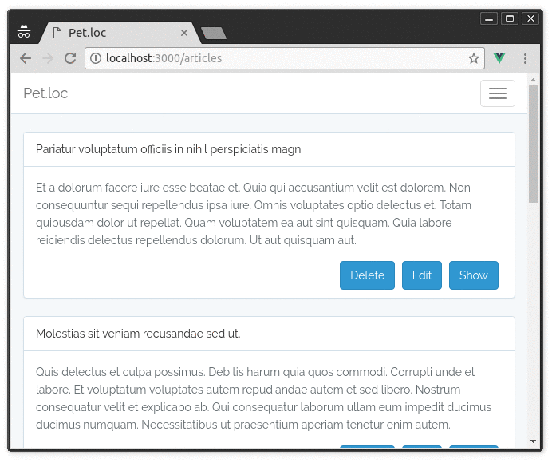
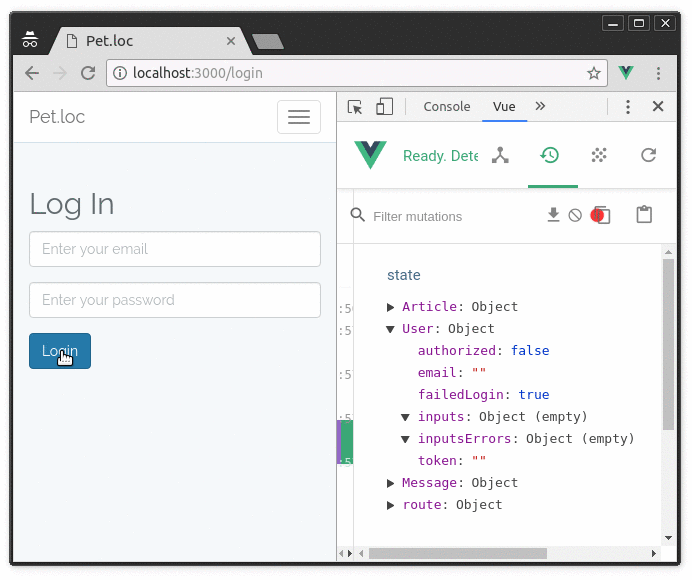

## Vue + Laravel typical cases

### What is it?

It is not best practices or standards. 

This is a just example which can be useful for newcomers or quick developing start. 

Here you can see how to create some application based at Vue and Laravel with most common features implementation what you typically need.



### Frontend

#### Cases:

- Registration/login
- Pagination
- Navigation
- Flash messages
- Simple CRUD
- Validation messages from laravel
- Simple preloader

#### What was used:

- ES6 (including stage-3)
- Bootstrap
- Vue
- Vuex (common FLUX implementation for Vue)
- Vue Router    
- Axios
- Laravel Mix (API for Webpack) 

### Backend

#### Cases:

- Auth controllers based on default scaffolding controllers, but for the JWT (JSON Web Tokens) 
- Simple typical Laravel migrations, seeds, models, controllers, routes, tests, middlewares, requests etc

#### What was used:

- Laravel 5.4
- Package "tymon/jwt-auth" - laravel JWT implementation
- Packages "laravel-debugbar", "laravel-ide-helper" just for development improving



### What can you see

#### Backend:

- [Routes](routes/)
- [Controllers](app/Http/Controllers/)
- [Jwt middleware](app/Http/Middleware/JwtAuth.php)
- [Validation via request](app/Http/Requests/ArticleRequest.php)
- [Models](app/Models/)
- [Tests](tests/Feature/)
- [Migrations](database/migrations/)
- [Factories](database/factories/)
- [Seeds](database/seeds/)
- [Docker](docker/)

#### Frontend:

- [File webpack.mix.js](webpack.mix.js)
- [Laravel views](resources/views/)
- [App initializing](resources/assets/js/app.js)
- [App structure](resources/assets/js/)
- [Vue components](resources/assets/js/components/)
- [Main component](resources/assets/js/components/App.vue)
- [Vue store structure](resources/assets/js/store/)
- [Vue router](resources/assets/js/router/index.js)

Components

- [Login/register](resources/assets/js/components/auth)
- [CRUD](resources/assets/js/components/article)
- [Flash messages](resources/assets/js/components/Message.vue)
- [Navigation bar](resources/assets/js/components/Navigation.vue)
- [Pagination (via Laravel pagination)](resources/assets/js/components/Pagination.vue)
- [Form inputs](resources/assets/js/components/input)
- [Mixin for auth checking in component](resources/assets/js/components/mixins/Check-auth.vue)

### How to install

Via Docker (just copy-past):

```bash
git clone git@github.com:dima-loburec/laravel-vue.git
cd laravel-vue/

# frontend:
docker run -v "$PWD":/usr/src/app -w /usr/src/app node:8 npm rebuild node-sass --force && npm install && npm run dev

# backend:
cd docker/
docker-compose up -d
# ensure the container name via "docker-compose ps" and run:
docker exec docker_app_1 bash -c "sh docker/app/install.sh"

# open http://localhost:8081/
```

Manually:

```bash
git clone git@github.com:dima-loburec/laravel-vue.git
# copy .env.example to .env and add your database (mysql 5.7+) credentials
# add vhost to your web-server for public folder
# run composer, artisan, npm:
sh sh/run.sh
npm run watch
```

Run tests

```bash
/vendor/bin/phpunit
```

If "npm run" doesn't work:

```bash
rm -rf node_modules
npm install
```
    
Or just try to update node and npm:

```bash
sudo npm install n -g
sudo n stable
sudo npm install npm@latest -g
```